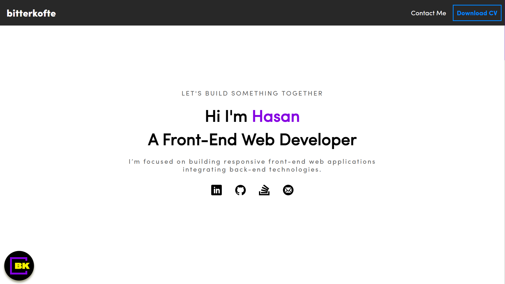

# Personal Website

## How To Run It

This is a [Next.js](https://nextjs.org/) project bootstrapped with [`create-next-app`](https://github.com/vercel/next.js/tree/canary/packages/create-next-app).

First, run the development server:

```bash
npm run dev
# or
yarn dev
# or
pnpm dev
```
## Preview Of The Website



You can access the website by clicking [here](https://bitterkofte.vercel.app/).